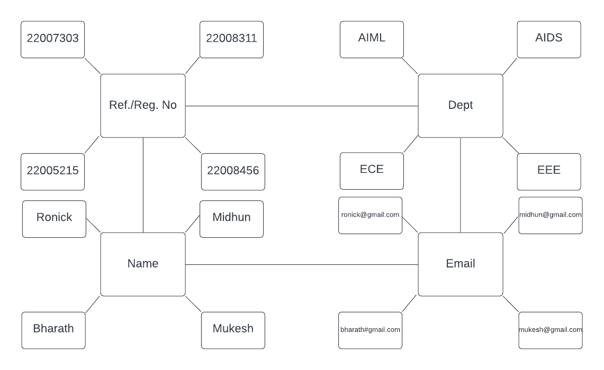
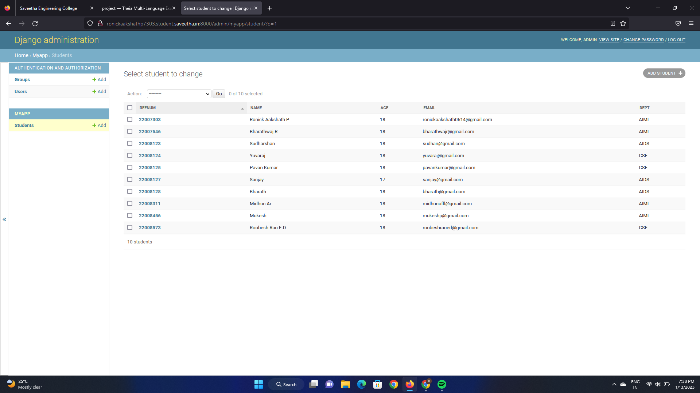

# Django ORM Web Application

## AIM
To develop a Django application to store and retrieve data from a database using Object Relational Mapping(ORM).

## Entity Relationship Diagram



## DESIGN STEPS

### STEP 1:
Creating a table using required details in Django--ORM
### STEP 2:
Upload the python code.
### STEP 3:
Push the code to github.

## PROGRAM

### admin.py
```
from django.contrib import admin
from .models import Student, StudentAdmin

# Register your models here.
admin.site.register(Student, StudentAdmin)
```
### manage.py
```
#!/usr/bin/env python
"""Django's command-line utility for administrative tasks."""
import os
import sys


def main():
    """Run administrative tasks."""
    os.environ.setdefault('DJANGO_SETTINGS_MODULE', 'django_orm_project.settings')
    try:
        from django.core.management import execute_from_command_line
    except ImportError as exc:
        raise ImportError(
            "Couldn't import Django. Are you sure it's installed and "
            "available on your PYTHONPATH environment variable? Did you "
            "forget to activate a virtual environment?"
        ) from exc
    execute_from_command_line(sys.argv)


if __name__ == '__main__':
    main()
```

## OUTPUT




## RESULT
Thus, the experiment was executed successfully.